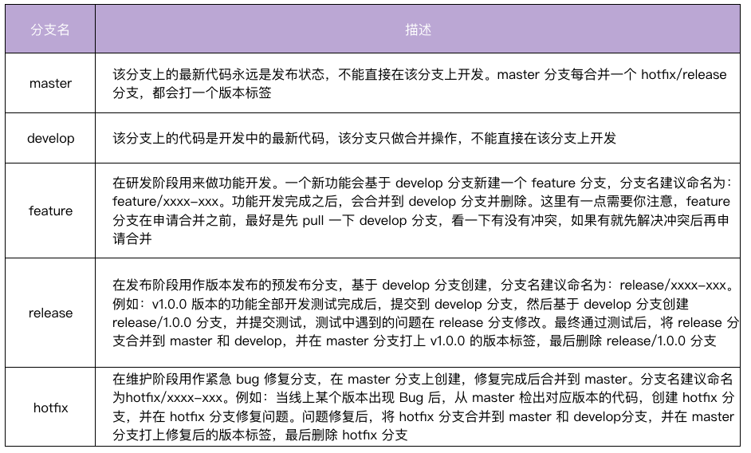

# git flow

git flow 流程如下图



示例场景:

- 当前版本为: 0.9.0
- 需要新开发一个功能
- 同时线上代码有 Bug 需要紧急修复

基本流程:

```shell
# 1. 创建要给常驻分支
git checkout -b develop master

# 2. 基于 develop 分支，新建一个功能分支：feature/hello-world。
git checkout -b feature/hello-world develop

# 3. feature/hello-world 分支上开发
echo "feature1" >> test.txt 

# 4. 开发过程中需要先紧急修复线上代码的 bug
git stash                                         # 临时保存修改至堆栈区
git checkout -b hotfix/error master               # 从 master 建立 hotfix 分支
echo "hotfix" >> test.txt                         # 修复 bug
git commit -a -m 'fix print message error bug'    # 提交修复
git checkout develop                              # 切换到 develop 分支
git merge --no-ff hotfix/error                    # 把 hotfix 分支合并到 develop 分支
git checkout master                               # 切换到 master 分支
git merge --no-ff hotfix/error                    # 把 hotfix 分支合并到 master
git tag -a v0.9.1 -m "fix log bug"                # 在 master 分支打上 tag
scp test root@target:/opt/                        # 编译并部署代码
git branch -d hotfix/error                        # 修复完成后删除 hotfix/xxx 分支
git checkout feature/hello-world                  # 切换到 feature 分支下
git merge --no-ff develop                         # develop 有更新，需要同步更新下
git stash pop                                     # 恢复到修复前的工作状态

# 5. 继续开发
echo "feature2" >> test.txt 

# 6. 提交代码到 feature/hello-world 分支
git commit -a -m "print 'hello world'"

# 7. 在 feature/hello-world 分支上做 code review
git push origin feature/print-hello-world         # 提交到远程仓库
# 创建 PR、指定 Reviewers 进行 CR

# 8. CR 过后，由代码仓库 Matainer 将功能分支合并到 develop 分支
git checkout develop
git merge --no-ff feature/hello-world

# 9. 基于 develop 分支创建 release 分支，测试代码
git checkout -b release/1.0.0 develop
cat test.txt 

# 10. 如果测试失败，直接在 release/1.0.0 分支修改代码，完成后提交并编译部署
git commit -a -m "fix bug"
scp test root@target:/opt/

# 11. 测试通过后，将 release/1.0.0 分支合并到 master 分支和 develop 分支
git checkout develop
git merge --no-ff release/1.0.0
git checkout master
git merge --no-ff release/1.0.0
git tag -a v1.0.0 -m "add print hello world" # master 分支打 tag

# 12. 删除 feature/hello-world 分支，也可以选择性删除 release/1.0.0 分支
git branch -d feature/hello-world
# git branch -d release/1.0.0
```
