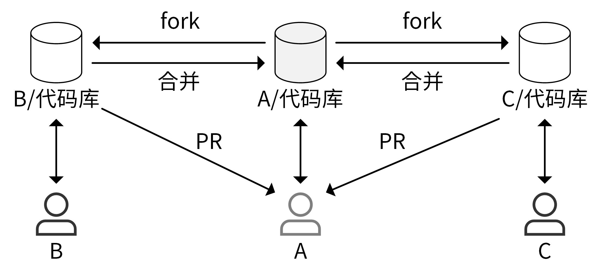

# git fork

常用于开源项目，开发者有衍生出自己的衍生版的需求，或开发者不固定、可能是任意一个能访问到项目的开发者。

其中 fork 操作是在个人远程仓库新建一份目标远程仓库的副本。



基本流程:

```shell
# 1. 在远程仓库上 fork 仓库：
# 比如 https://github.com/liangjisheng/learngit => https://github.com/userA/learngit

# 2. clone 到本地
git clone https://github.com/userA/learngit
cd learngit
git remote add upstream https://github.com/liangjisheng/learngit
git remote set-url --push upstream no_push # 不要 push 到 upstream master
git remote -v # 查看远程分支
# origin  https://github.com/userA/learngit (fetch)
# origin  https://github.com/userA/learngit (push)
# upstream  https://github.com/liangjisheng/learngit (fetch)
# upstream  https://github.com/liangjisheng/learngit (push)

# 3. 创建功能分支
git fetch upstream                       # 同步本地仓库的 master 分支为最新状态（与 upstream master 分支一致）
git checkout master
git rebase upstream/master
git checkout -b feature/add-function     # 创建功能分支

# 4. 提交 commit
git fetch upstream                       # commit 前需要再次同步 feature 跟 upstream/master
git rebase upstream/master
git add xxx
git status
git commit
git rebase -i origin/master              # 合并多个、保留较少的 commit
# git reset HEAD~5
# git add .
# git commit -am "Here's the bug fix that closes #28"
# git push --force

# 5. push 功能分支到个人远程仓库
git push -f origin feature/add-function

# 6. 创建 PR，请求 Reviewers review、合并到 master
# 创建 pull request 时，base 通常选择目标远程仓库的 master 分支。
```
